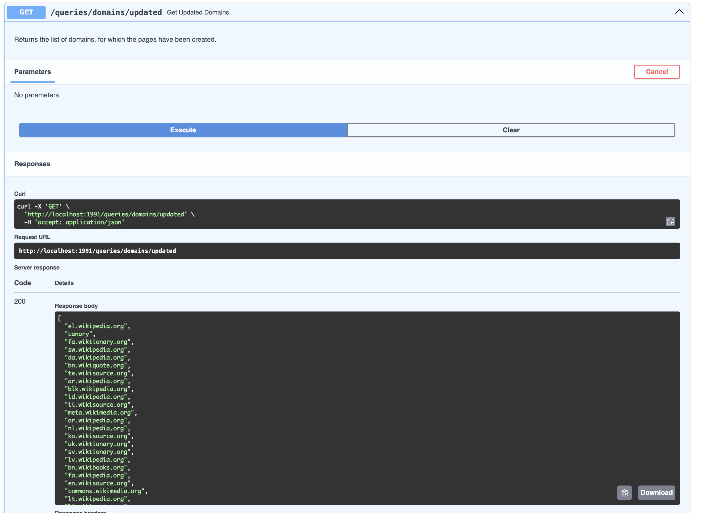
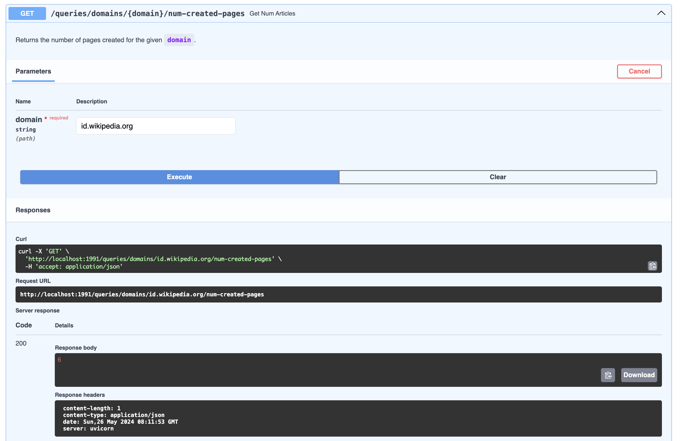
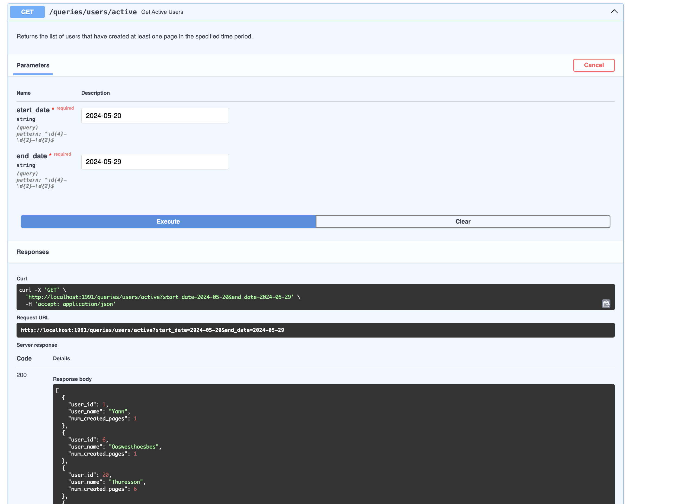
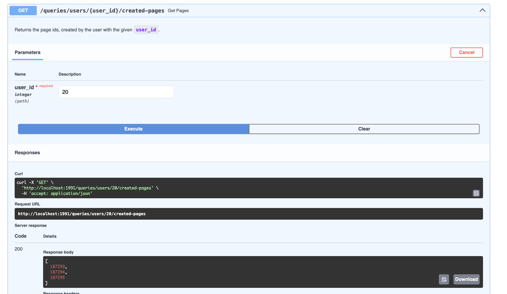

# StreamOnWiki
Implementation of the Wikipedia project proposed in the Big Data Processing course at UCU.

# Requirements
- `Docker`
- $8$ GB of RAM.
# System Design
## Deliverables
The application monitors created pages on Wikipedia and accumulates the following data:
- Domains where the pages were created, referred to as "updated domains";
- Pages by specified users;
- Number of pages created for a specified domain;
- Page information for a specified page ID;
- Users who created at least $1$ page in the specified time range, referred to as "active users".

## Service Dependencies
The micro-service architecture was used for implementation. The dependencies are managed in [`compose.y[a]ml`](compose.yaml) with `depends_on` attribute and environment variables. Common configurations are created at the top to add more Cassandra nodes, if necessary, easily.

## Main Services
- Kafka;
- Wikipedia events producer;
- Cassandra Cluster consisting of $2$ nodes;
- Spark Cluster: $1$ master and $1$ worker;
- REST API.
## Pipeline
The messages are listened to from the Wikipedia-created pages endpoint by the producer service. If the message has all required fields, it is sent to the Kafka topic `wiki-events`.
The messages from `wiki-events` are processed with [Spark Streaming](services/streaming/spark_streaming.py). They are then sent to Cassandra's tables.
REST API service interacts with Cassandra directly and only implements `GET` requests.

## Tools Justification
- **Kafka**: Kafka is chosen for its ability to provide fast, reliable, and durable process communication. This ensures that messages from the Wikipedia events producer are not lost even if the producer or the Spark Streaming service experiences shutdowns. It is easy to maintain and integrates well with other tools.

- **Spark Streaming**: The high throughput of the Wikipedia events stream makes Spark Streaming a great choice: it excels at handling high-volume data streams without needing immediate real-time processing. It supports vectorized operations on DataFrames, allowing efficient processing of Kafka messages and seamless data storage in Cassandra. - The well-designed API of Spark Streaming further enhances its ease of use and integration.-

- **Cassandra**: Cassandra is utilized for its superior scalability and ability to handle large volumes of data efficiently. Its distributed architecture ensures high availability and fault tolerance through data replication. Cassandra's flexible schema design optimizes table structure to ensure quick and efficient query responses.

- **FastAPI**: FastAPI is chosen for its high performance and speed in handling HTTP requests. It provides built-in support for request schema definitions and parameter validation.

## Data Modelling
Cassandra table schemas can be found [here](services/wiki-ddl/ddl.cql). The first $3$ schemas are self-explanatory.
- `domain_pages` lists the number of pages updated for each domain. Column's `num_pages` type `COUNTER` makes updating the table entries easy.
- `active_users_by_date` stores the number of created pages for each user given a date (YYYY-MM-DD format.) `COUNTER` is used for similar purposes as in the previous table.
	When one wants to access the active users for a time period $\text{[start:end]}$, 
	the REST API server iterates over all the dates in between and accumulates the users' results.
	Note: this approach may not be the most efficient when the length of time interval becomes large, and also it requires to store a lot of data in Cassandra.
	Possible improvements:
	- forbid the requests when the interval length is greater than a month;
	- choose different approach for data modelling.

# Request Examples
After the app has worked for some time, we can verify the availability of REST API.



We get the list of domains that were updated during application uptime.
Let's explore the domain `id.wikipedia.org`:



We see that $6$ pages have been created on this domain.
___
Active users:



Each active user has three fields: `user_id`, `user_name`, and `num_created_pages`. The result is sorted by `user_id`.

Let's explore the created pages by a user account with ID $20$:



Now, we can provide more details, for example, for the page with ID $187294$:


All the endpoints are tested when the request parameters are missing from DB.


# Start/Stop the Services
Start all with:
```bash
docker compose up -d
```

Stop all:
```bash
docker compose down [--volumes]
docker rmi kafka-producer wiki-ddl wiki-rest-api  # locally built images
```

